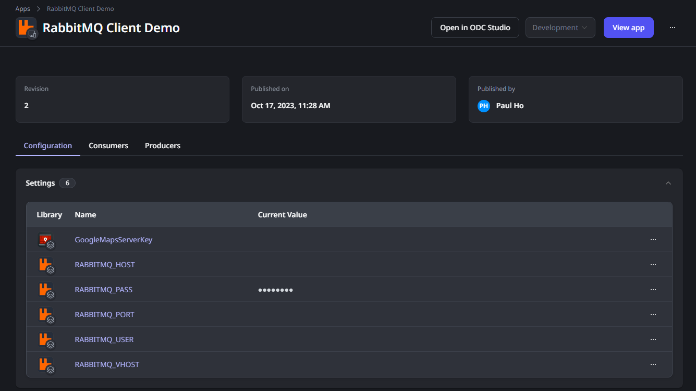

# Rabbit MQ Client for ODC

## Introduction
OutSystems Developer Cloud (ODC) is a cloud-native app development platform that provides a modular, scalable environment in which you develop and deploy your apps. With ODC you can build and deploy enterprise-grade, mission-critical apps in weeks. You can build web apps, web portals, mobile apps, and business workflows faster than with traditional development tools. You can then deploy your apps in a scalable, secure, and high-performance environment.

This connector has two parts:

1. A custom code extension : RabbitMQClient_ExternalLogic
2. A library that uses the underlying custom code extension: RabbitMQ Client (Black Belt Edition)

The connector provides the following functionality (as of now):
1. PurgeQueue
2. Receive
3. Send

There is also a operational support API to discover the unique build number for this connector so that any bugs discovered can be reported against this unique build number. The API is

1. GetBuildInfo


## Pre-requisites

To use this component correctly, you should have a working and running RabbitMQ instance. You should also ensure that you have:

1. Valid credentials to the RabbitMQ instance
2. A working virtual host setup 
3. A working exchange setup
4. A working queue setup (remember to bind the queue to the exchange with a valid routing key)


## Installation
You can install the connector through [ODC Forge](https://success.outsystems.com/documentation/outsystems_developer_cloud/forge/install_or_update_a_forge_asset/#install-a-forge-asset).

You should install both the custom code extension as well as the RabbitMQ Client (Black Belt Edition) library. 

## How to Use
### Add library to your application
Firstly, add the _RabbitMQ Client (Black Belt Edition)_ library to your application as shown below.

 

Depending whether you want to use all the APIs, you can selectively add the needed APIs (or removed unused ones automatically later).


### Configuration
The _RabbitMQ Client (Black Belt Edition)_ library requires a few settings to be configured in ODC portal for your application which is using the library:

| S/No.| Name of setting | Remarks |
|------|-----------------|---------|
| 1.   | RABBITMQ_HOST   | The hostname / IP address of the rabbit MQ server |
| 2. | RABBITMQ_PASS | The password to connect to the rabbit MQ server |
| 3. | RABBITMQ_PORT | The port number to connect to the rabbit MQ server (default value: 5672)|
| 4. | RABBITMQ_USER | The username to connect to the rabbit MQ server |
| 5. | RABBITMQ_VHOST | The virtual host to connect to |
  

 

### Example 1: Send a message

To send a message, you will need to supply the right configuration values. The screenshot below gives an example. Not all values are mandatory as you can see. It is recommended to have a client action (in the demo application, it is set up in GetMQConfigInfo client action) that supplies standard values across the application and override values when applicable. 


NOTE: For the queue type, you should use the supplied Entities.QueueType. 

### Example 2: Receive a message

To receive a message, you will need to supply the right configuration values. The screenshot below gives an example. Not all values are mandatory as you can see. In this case, the placeholder value for _isExclusive_ is not needed and hence not supplied. 


### Example 3: Advance use with ODC private gateway

This library is capable to integrate with ODC private gateway. This allows your ODC application to send/receive messages to a RabbitMQ server instance that is on-premise. 

An example of an outsystems cloud connector string is 

```
./outsystemscc --header "token:<REPLACE WITH YOUR TOKEN SUPPLIED BY ODC ADMIN>" <REPLACE WITH YOUR SECURE GATEWAY URL SUPPLIED BY ODC ADMIN> R:<ODC PORT TO COMMUNICATE>:<HOSTNAME OR IP OF RABBITMQ SERVER>:<PORT OF RABBITMQ SERVER>
```

example (with confidential information replaced):

```
./outsystemscc --header "token:_my_secret_token_" https://some-value.outsystems.app/some-other-values-here R:5001:172.20.80.129:5672
```

It is important to supply the same port number (5001) for what you have supplied in outsystemcc and set it to the _RABBITMQ_PORT_ in ODC portal. The _RABBITMQ_HOST_ value *must* be _secure-gateway_ (all in small caps). 


## Limitation
1. Only text messages are allowed. If you need to send binary data, you might want to encode it as base64 before sending
2. The maximum payload sent/receive is 5.5 MB 

## Found a bug?

Kindly submit your bug report [here](https://github.com/PaulHoOutsystems/odc-rabbitmq-client/issues) and do indicate the build number of the library which you are using too.

## Contact

You can reach out to me via email at paul.ho@outsystems.com 
